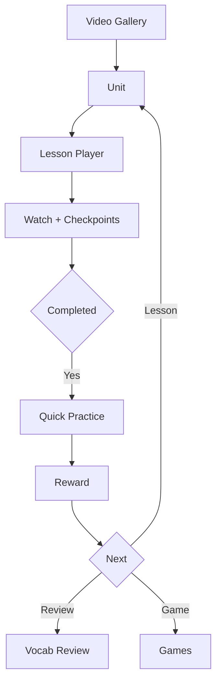

# 📘 WATCH & LEARN – VIDEO-BASED LEARNING

## FULL FUNCTIONAL SPEC (WITH CONTENT OPS & ADMIN)

---

## 0. MỤC TIÊU & ĐỊNH VỊ

### 0.1 Vấn đề cần giải quyết

* Xem video xong là quên
* Không đo được học tới đâu
* Video tách rời game
* Mỗi lần sửa nội dung phải nhờ dev

### 0.2 Giải pháp

Biến video thành **Learning Lesson có vòng đời nội dung**, với chu trình:

> **Watch → Checkpoint → Learn vocab → Practice → Reward → Recommend Game**

### 0.3 Vị trí trong hệ thống

* Module **song song với Games**
* Chia sẻ:
  * Vocabulary
  * Progress
  * XP / Stars / Stickers
* Là nền tảng kiến thức cho game

---

## 1. ĐỐI TƯỢNG SỬ DỤNG

### 1.1 Học sinh

* Xem video
* Học từ
* Làm quiz nhanh
* Nhận thưởng
* Học offline

### 1.2 Content team / Giáo viên

* Soạn bài
* Sửa nội dung
* Publish không cần dev
* Theo dõi ảnh hưởng khi sửa

### 1.3 Admin

* Kiểm soát chất lượng
* Versioning
* Dependency
* A/B quiz

---

## 2. CẤU TRÚC NỘI DUNG (CONTENT MODEL)

### 2.1 Category

```
Category
- id
- name
- order
```

### 2.2 Unit

```
Unit
- id
- title
- description
- categoryIds[]
- order
- status (draft | published | archived)
```

### 2.3 Lesson (logic entity)

```
Lesson
- id
- unitId
- currentVersionId
```

---

## 3. VERSIONING & CONTENT OPS (CỐT LÕI SCALE)

### 3.1 Lesson Version

```
LessonVersion
- id
- lessonId
- versionNumber
- status (draft | published | archived)
- videoSource (youtube | cdn | local)
- videoUrl
- durationSec
- learningObjectives[]
- difficulty (1–5)
- vocabIds[]
- checkpointIds[]
- recommendedGameTypes[]
- createdBy
- createdAt
- changelog
```

### 3.2 Quy tắc versioning (BẮT BUỘC)

* Không sửa trực tiếp version published
* Mọi chỉnh sửa → tạo **version mới**
* Publish version mới → version cũ archived
* Học sinh:
  * đang học version cũ → tiếp tục
  * học mới → dùng version mới

---

## 4. VOCABULARY & PROGRESS

### 4.1 Vocabulary

```
Vocab
- id
- word
- ipa
- meaningVi
- imageUrl
- audioUrl
```

### 4.2 Vocab progress

```
UserVocabProgress
- userId
- vocabId
- status (new | seen | practiced | mastered)
- correctCount
- wrongCount
- lastReviewedAt
```

---

## 5. CHECKPOINT – ĐIỂM DỪNG HỌC

### 5.1 Checkpoint model

```
Checkpoint
- id
- lessonVersionId
- timeSec
- type (vocab | micro_quiz | note | repeat)
- vocabId?
- question?
- options?
- answer?
```

### 5.2 Hành vi

* Đến timeSec → overlay hiện
* Mặc định **không pause**
* Study Mode bật → pause + bắt buộc xác nhận

---

## 6. LOGIC XEM VIDEO & HOÀN THÀNH (ANTI-SKIP)

### 6.1 Bucket tracking

* Video chia bucket 10s
* Bucket hợp lệ khi:
  * playback đi qua
  * dwell ≥ 30–50%

### 6.2 Completion rule

Lesson `completed` khi:

* watchedBucketPercent ≥ 90%
* minPlayTime ≥ 30% duration
  (video <30s → ≥70%)

❌ Tua tới cuối không đủ bucket → **không completed**

---

## 7. QUICK PRACTICE (QUIZ)

### 7.1 Quiz là entity độc lập

```
Quiz
- id
- lessonVersionId
- difficulty
- status
```

### 7.2 Quiz variant (A/B)

```
QuizVariant
- id
- quizId
- variant (A | B)
- weight
- questions[]
```

### 7.3 Quiz types (MVP)

* Audio → choose card
* Image → choose word
* Word → choose image

### 7.4 Mastery update

* Correct 1 lần → seen → practiced
* Correct ≥3 lần → mastered

---

## 8. REWARD & MOTIVATION

### 8.1 Reward screen

* Stars (1–3)
* XP
* Sticker (1 lần)

### 8.2 Rule

```
3★: completed + quiz ≥80%
2★: completed + quiz 50–79%
1★: completed + quiz <50% / skip
```

---

## 9. VIDEO → GAME RECOMMENDATION

### 9.1 Mapping

| Kiến thức | Game             |
| --------- | ---------------- |
| Từ + hình | Listen & Tap     |
| Câu       | Sentence Builder |
| Phát âm   | Speak Match      |
| Bối cảnh  | Hide & Seek      |

### 9.2 Rule

* Chọn 1–2 game
* Coverage vocab cao nhất
* Ưu tiên vocab user hay sai

---

## 10. OFFLINE LEARNING

### 10.1 Download

```
DownloadItem
- lessonVersionId
- status
- progress
- sizeBytes
- quality
- localPath
```

### 10.2 Offline sync

* Lưu local progress + quiz
* Online lại → sync delta
* Merge watchedBuckets

---

## 11. PROGRESS MODEL

### 11.1 Lesson progress

```
UserLessonProgress
- userId
- lessonVersionId
- lastTimeSec
- watchedBuckets[]
- watchedPercent
- status
- completedAt
```

### 11.2 Unit progress

```
UserUnitProgress
- userId
- unitId
- completedLessons
- totalLessons
- percentDone
```

---

## 12. UNLOCK RULE (UNIT)

* Lesson 1 mở sẵn
* Lesson N mở khi Lesson N-1 completed
* Locked lesson → hiển thị lý do

---

## 13. CONTENT DEPENDENCY (RẤT QUAN TRỌNG)

```
Dependency
- sourceType (lesson | vocab | quiz | game)
- sourceId
- targetType
- targetId
- impact (blocking | warning | info)
```

* Không cho publish nếu dependency blocking
* Admin phải resolve trước

---

## 14. ADMIN MODULE

### 14.1 Roles

* SuperAdmin
* ContentAdmin
* ContentEditor

### 14.2 Admin Screens

* Unit Manager
* Lesson Manager (version history)
* Lesson Editor (video, vocab, checkpoint timeline)
* Quiz Manager (A/B)
* Dependency Viewer
* Publish / Archive

### 14.3 Admin rules

* Không publish thiếu quiz
* Không publish thiếu checkpoint
* Publish luôn tạo version mới
* Không xoá content đã published

---

## 15. API (RÚT GỌN)

### Content

* `GET /units`
* `GET /lessons/:id`
* `GET /lessons/:id/versions`

### Progress

* `POST /me/progress/heartbeat`
* `POST /me/progress/complete`

### Admin

* `POST /admin/lessons/:id/draft`
* `POST /admin/lessons/:id/publish`
* `GET /admin/dependencies`

---

## 16. STATE MACHINE

```
INIT → READY → PLAYING → PAUSED
→ ENDED → PRACTICE → REWARD → EXIT
```

---

## 17. END-TO-END FLOW (MERMAID)



---

## 18. ACCEPTANCE CRITERIA

* Không tua là completed
* Checkpoint hiện đúng
* Quiz tự sinh từ vocab
* Versioning không phá progress
* Content sửa không cần dev
* Video → Game liền mạch

---

# 🔚 KẾT LUẬN

👉 **Đây là bản spec “đóng gói hoàn chỉnh”**
